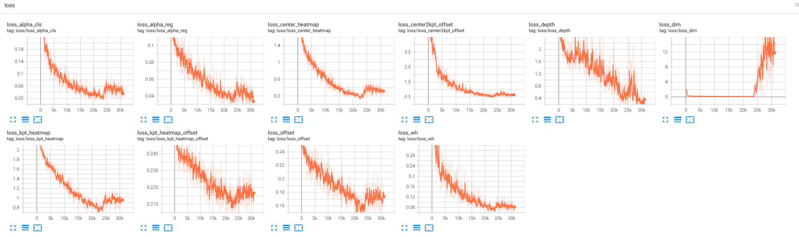

# monocon_rp (2022.08.10)
此项目用于复现monocon 
源码地址：https://github.com/chenzihao008/monocon-pytorch.git
## 修改部分
### 将训练源码修改为DDP训练,使用mp.spwan启动，单机单卡、单机多卡均可使用
- [修改了以下文件：]
- engine\base_engine.py
- engine\monocon_engine.py
- train.py
### 存在dataloader多进程读取数据占用显存问题
## environment
- [显卡] 3080*1 10G
- [CUDA] 10.1
## 复现数据集
- [kitti] https://www.cvlibs.net/datasets/kitti/eval_object.php?obj_benchmark=3d
- [训练:验证数据比例] 3712:3769
## setting
- [batchsize] 8
- [epoch] 200
## traget创建方式

## 训练记录
- [time/epoch] 5-7mins
- [epoch:115] 
----------- Eval Results ------------

Pedestrian AP40@0.50, 0.50, 0.50:
bbox AP40:49.6264, 39.1815, 32.5803
bev  AP40:2.4284, 2.0529, 1.8834
3d   AP40:2.1300, 1.7796, 1.3170
aos  AP40:39.36, 30.62, 25.27

Pedestrian AP40@0.50, 0.25, 0.25:
bbox AP40:49.6264, 39.1815, 32.5803
bev  AP40:13.6819, 10.8073, 9.4292
3d   AP40:13.1637, 10.4792, 9.0917
aos  AP40:39.36, 30.62, 25.27

Cyclist AP40@0.50, 0.50, 0.50:
bbox AP40:61.2945, 33.7005, 31.3321
bev  AP40:4.5178, 2.2949, 2.1737
3d   AP40:3.7567, 1.9922, 1.5229
aos  AP40:55.24, 30.34, 28.10

Cyclist AP40@0.50, 0.25, 0.25:
bbox AP40:61.2945, 33.7005, 31.3321
bev  AP40:19.9975, 10.6099, 9.3342
3d   AP40:19.6833, 10.3631, 9.1433
aos  AP40:55.24, 30.34, 28.10

Car AP40@0.70, 0.70, 0.70:
bbox AP40:96.0738, 78.1678, 70.8113
bev  AP40:17.5216, 10.9126, 9.0341
3d   AP40:9.7757, 6.3920, 5.1801
aos  AP40:94.61, 76.57, 68.84

Car AP40@0.70, 0.50, 0.50:
bbox AP40:96.0738, 78.1678, 70.8113
bev  AP40:51.2260, 32.1783, 27.4159
3d   AP40:44.6220, 28.2990, 22.9361
aos  AP40:94.61, 76.57, 68.84

Overall AP40@easy, moderate, hard:
bbox AP40:68.9982, 50.3499, 44.9079
bev  AP40:8.1559, 5.0868, 4.3637
3d   AP40:5.2208, 3.3879, 2.6733
aos  AP40:63.07, 45.85, 40.74
- [training_loss]
 

## 优化策略及数据对比
## 知识补充
